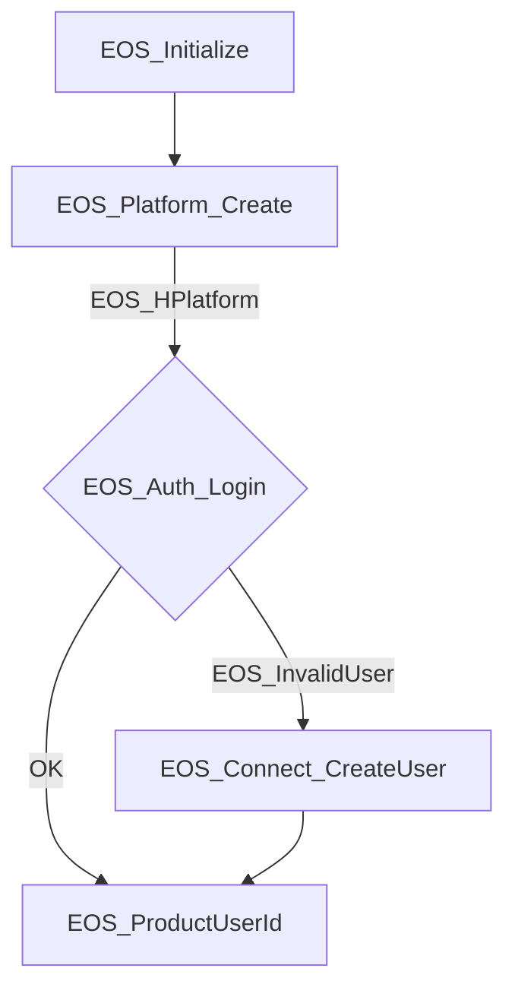

# eos_console_test

This program is lobby function's test for Epic Online Services (EOS).

---

## 1.実行準備

### Webサイト上で、アプリケーション登録を行い、テスト用の認証情報を用意します。

1. サインインにはEPICアカウントが必要です、未作成であれば EPIC アカウントを作成します

   

1. [DevPortal](https://dev.epicgames.com/portal/ja/) にサインインします

   

1. 「製品を作成」からeos_console_test用の製品（プロダクト）を作成します

   

1. 「製品」から作成したプロダクトを選択します

   

1. 「製品設定」を選びます、「製品設定」の画面へ遷移するので「クライアント」をクリックします

   

1. 契約同意していない場合、ここで確認が出ます

   

1. 同意直後は下記のような画面が出ることがあります、リロードすることで先に進めます

   

1. 「新規クライアントを追加」を選択します

   

1. 新しく追加するクライアントの設定を行います、「クライアント名」を設定したら、「新規クライアントポリシーを追加」をクリックします

   

1. クライアントポリシーは、EOSのどの機能を利用するかの許可設定を行います、Peer2Peerを選ぶと今回必要としているlobbies,matchingが利用できるポリシーとなります、設定ができたら「新規クライアントポリシーを追加」をクリックします

   

1. 「新規クライアントを追加」をクリックしてクライアントを作成します

   

1. クライアントの設定が完了したら、クライアントの画面にはこのような情報が表示されます

   

1. クライアントが作成できたので、アプリケーションを作成します、「Epicアカウントサービス」をクリックします。
同意がされていない場合、図のような画面になります、同意する必要があります。

   

1. アプリケーションを作成、アプリケーションにクラアントを関連付けする画面です、

   作成済みのアプリケーションは「アプリケーション」の項目にならんでいます。

   初期状態で一つ用意されているのでそれを利用するか、「アプリケーションを作成」から新規に作成します。

   

1. 「アプリケーション」からクライアントを設定するアプリケーションの「アクセス許可」を選択します。

   「アクセス許可」ではログイン時に指定する「EOS_EAuthScopeFlags」と同じ設定になるように許可を行う必要があります、

   eos_test_consoleは「Basic Profile」のみ要求しているのでデフォルトの設定のまま「変更を保存」を選択します

   

1. 次に「リンク済みのクライアント」を設定します、「クライアントを選択」から作成したクライアントを選択し、「変更を保存」を選択します

   

1. 次に「リンク済みのクライアント」を設定します、「クライアントを選択」から作成したクライアントを選択し、「変更を保存」を選択します

   

1. 設定が終わったので、アプリケーションの認証情報を作成します、「製品設定」へ移動します

   

1. 「ヘッダーファイルで認証情報を使用する」を選択します

   

1. 「理解しました」をクリックすると、認証用のコードが作成されます、右上にコピーボタンがあるのでコピーして利用します。

   

---

## ビルド

1. eos_console_testのルートフォルダにcredentials.hを作成し、認証用コードを貼り付けます

1. 「SDKとリリースノート」から「C SDK」の「EOS-SDK-27379709-v1.16.1」をダウンロードし、eos_console_testのルートフォルダへ解凍します

1. eos_console_test.slnをvs2022で開きビルドを行います

---

## 実行内容

   アプリケーション認証情報とログイン情報を使ってEOSに接続し、ロビー作成、属性設定、検索のテストを行う構成になっています

## ログイン、認証手順

